# Netty学习笔记

## （一） 基础篇

### 1、I/O基础

输入流：InputStream和Reader
输出流：OutputStream和Writer

​                字节流                字符流

计算机最小的二进制单位   bit 比特    代表0和1
字节  1 byte = 8bit  计算机处理的最小单位
字符  1 char = 2byte = 16bit   人处理的最小单位

所以，字节流处理文件、图片、视频等二进制数据，而字符流处理文本数据。  


### 2、Socket

原意是“插座”，在计算机领域中，翻译为“套接字”。
本质上，是计算机之间进行通信的一种方式。

Linux，“一切皆文件”，给每个文件映射一个ID，叫做"文件描述符"。
当处理网络连接时，也会看成一个文件，read/write变成和远程计算机的交互。

OSI七层模型 = Open System Interconnection 开放式系统互联
从下到上分别为：物理层、数据链路层、网络层、传输层、会话层、表示层和应用层。

实际应用的是优化后的TCP/IP模型（四层）
                                  网络接口层/链路层、网络层、传输层、应用层

应用层协议：HTTP、FTP、SMTP（邮件协议）
传输层协议：TCP、UDP

Socket其实是应用层与传输层之间的抽象层，是一组接口。
在设计模式中，是门面模式。


### 3、NIO

BIO - BlockingIO  同步阻塞
NIO - New IO /  Non-Blocking IO  同步非阻塞
AIO - Asynchronous IO  异步非阻塞

同步和异步，关注的是消息通知的机制
阻塞和非阻塞，关注的是等待消息过程中的状态

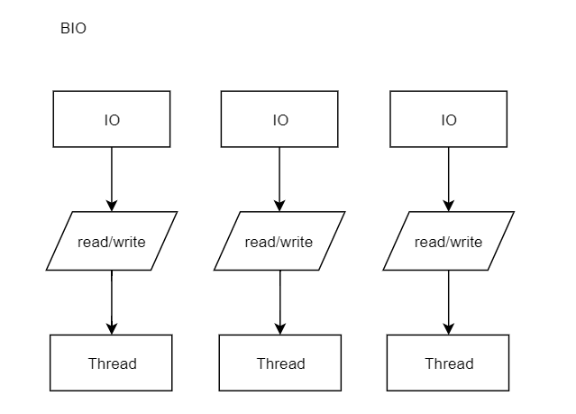


多路复用的模型

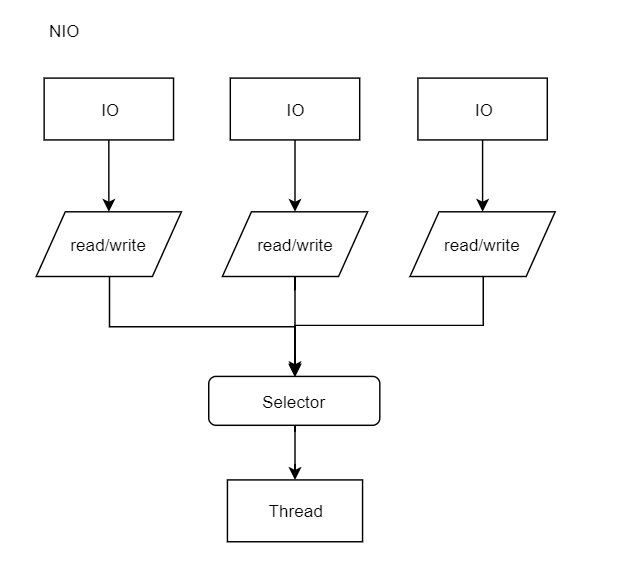


三大元素：Channel 、Buffer、Selector

#### 1)  Channel

FileChannel   文件管道的数据
Pipe.SinkChannel
Pipe.SourceChannel  线程间通信的管道
ServerSocketChannel
SocketChannel      用于TCP网络通信的管道
DatagramChannel   用于UDP网络通信的管道

#### 2) Buffer

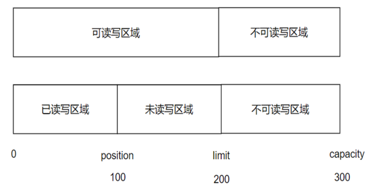

capacity  总体容量大小
limit   存储容量的大小，是可读写和不可读写的界线
position  已读容量的大小，已读和未读区域的界线


【使用原理】
a)  初始化，给定总容量，position=0, limit=capacity
b)  当使用put方法存入数据是，通过position来记录存储的容量变化，position不断后移，直到存储结束（写完成）
c）写完成需要调用flip方法刷新，limit=position，position=0
      保障limit记录的是可读写区域的大小，position已读部分重置为空
d)  读数据直到读完成，需要调用clear方法，position=0, limit=capacity


#### 3)  Selector

三个元素： Selector选择器、SelectableChannel可选择的通道、SelectionKey选择键

本质上，Selector是监听器，监听的是通道是否有我们关心的操作产生，操作对应的是事件（连接、接收、读/写），使用SelectionKey代表具体的事件，在确保通道是可选择的情况下，将通道注册进选择器中，此时Selector维护的是，通道和事件之间的关联关系。


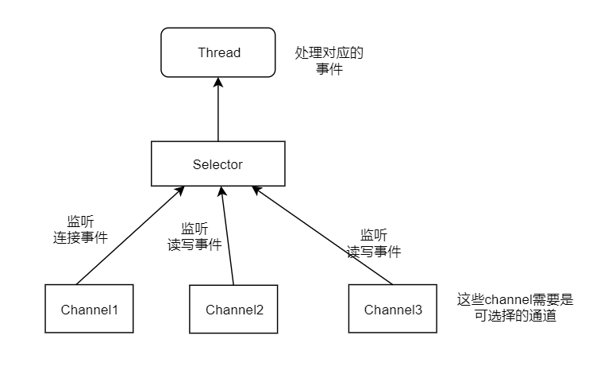

Selector，管理被注册的通道集合，以及他们的状态
SelectableChannel，是一个抽象类，提供了通道可被选择需要实现的api。
      FileChannel就不是可选择的，Socket相关的通道都是可选择的
      一个通道可以被注册到多个选择器上吗？   可以的
     多个通道可以注册到一个选择器上，但一个通道只能在一个选择器中注册一次   

SelectionKey，封装了要监听的事件，连接、接收、读、写。
     一方面，Selector关心通道要处理哪些事件
    另一方面，当事件触发时，通道要处理哪些事件


【使用方式】

a、首先通过open方法，获取通道，将通道设置为非阻塞的
b、通过open方法，获取选择器，将通道注册进选择器中，伴随设置通道要处理的事件(OP_ACCEPT)
c、轮询选择器，当前是否有要处理的操作 select() > 0?
           如果有，要获取，待处理操作的集合Set\<SelectionKey> , 进行遍历
                  遍历到SelectionKey时，判断对应哪种操作，不同的操作设置不同的处理方式 
                      如OP_ACCEPT，接收客户端通道并进行注册，监听后续处理的事件，如OP_WRITE
                      如OP_WRITE，通过key的方法获取通道本身，读取数据并继续监听事件，如OP_READ

​            

### 4、零拷贝

需求：将磁盘中的文件读取出来，通过socket发送出去

传统的拷贝方式（4次）
      Socket网络缓冲区，也属于操作系统的内核缓冲区。

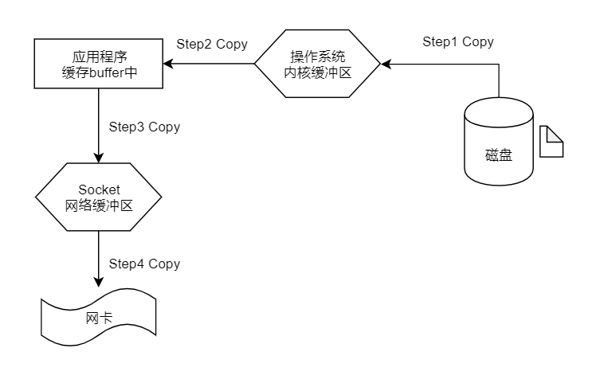

在操作系统中进行的拷贝（如第二次和第三次），叫做CPU拷贝。
连接磁盘或网卡等硬件的拷贝（如第一次和第四次），叫做DMA拷贝。

零拷贝的概念：减少CPU拷贝的次数。

零拷贝是基于操作系统层面的优化方式（以下基于Linux系统）

1） mmap = memory mapping 内存映射

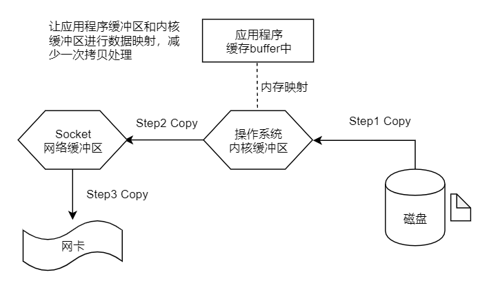

2）sendfile (linux2.1内核支持)

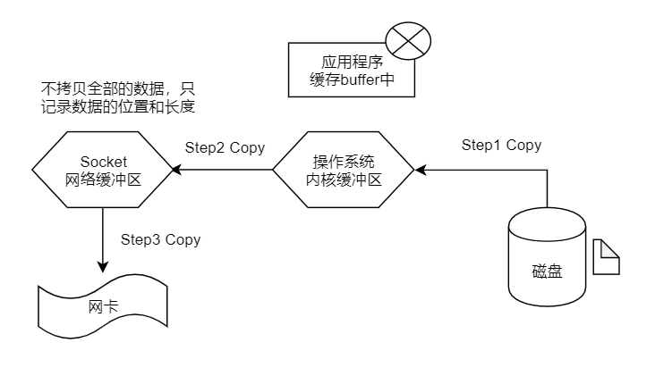

3)  sendfile with scatter/gather  copy（批量sendfile）
     从单个文件的处理，上升到多个物理地址的处理，提高处理速度

4）splice （拼接，在linux2.6内核支持）

​    在操作系统内核缓冲区和Socket网络缓冲区之间建立管道，来减少拷贝次数。

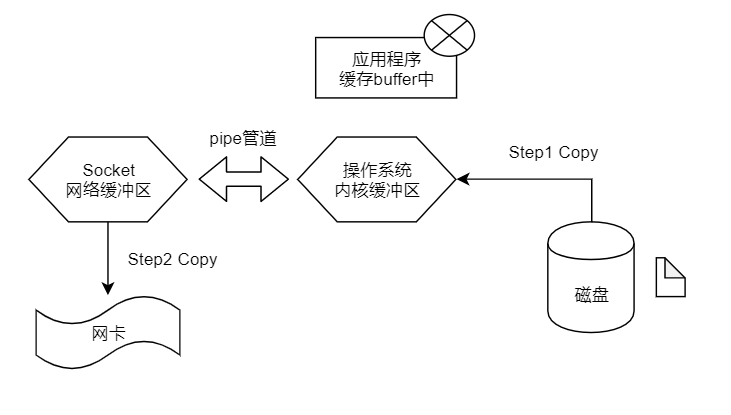


### 5、线程模型


##### 1） 单线程Reactor模型

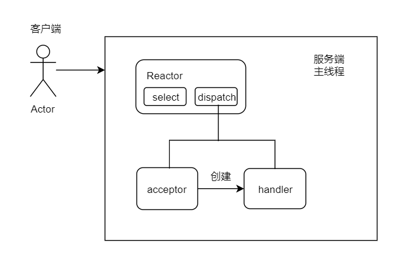

##### 2）多线程Reactor模型

提高handler的处理效率，首先handler不再负责具体的业务逻辑，当读取出数据后，分发给子线程处理，子线程处理完成后再将结果返回给handler，handler再将结果返回给客户端。

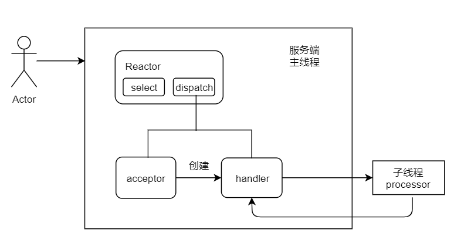

##### 3）主从Reactor模型

mainReactor用来接收连接事件，然后分发给acceptor，acceptor在处理过程中，直接将后续的读写事件，注册到slaveReactor之中，以此来达到分流。

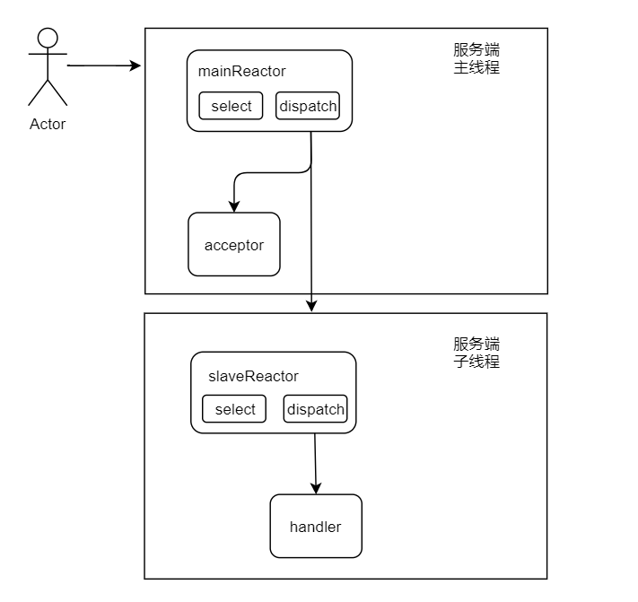


## （二） 应用篇

### 1、HTTP

#### 1)  0.9版本

```
GET /index.html
```

服务端只能返回html格式，传输过程只能处理文字。

#### 2)  1.0版本

支持任何格式的内容，包括图像、视频、二进制等等

引入了POST命令、HEAD命令

增加了请求头、状态码，以及权限、缓存等

```
GET / HTTP/1.0
User-Agent:Mozilla/1.0
Accept: */*
```


```
HTTP/1.0 200 OK
Content-Type: text/plain
Content-Encoding: gzip

<html>
  <body> hello world </body>
</html>
```

a、 Content-Type

服务端通知客户端，当前数据的格式

示例： text/html 、 image/png 、 application/pdf 、 video/mp4

前面是一级类型，后面是二级类型，用斜杠分隔； 还可以增加其他参数，如编码格式。

```
Content-Type: text/plain; charset=utf-8
```

b、Content-Encoding

表示数据压缩的方式，gzip、compress、deflate

对应客户端的字段为  Accept-Encoding，代表接收哪些压缩方式

c、缺点和问题

每个TCP连接只能发送一个请求，发送完毕连接关闭，使用成本很高，性能较差。

```
Connection: keep-alive   - 非标准字段
```

#### 3)  1.1版本

```
GET / HTTP/1.1
User-Agent: PostmanRuntime/7.24.1
Accept: */*
Cache-Control: no-cache
Postman-Token: 636ce8a6-7eab-451a-8638-4534a3578095
Host: cn.bing.com
Accept-Encoding: gzip, deflate, br
Connection: keep-alive

HTTP/1.1 200 OK
Cache-Control: private, max-age=0
Content-Length: 45786
Content-Type: text/html; charset=utf-8
Content-Encoding: br
Vary: Accept-Encoding
P3P: CP="NON UNI COM NAV STA LOC CURa DEVa PSAa PSDa OUR IND"
Set-Cookie: SRCHD=AF=NOFORM; domain=.bing.com; expires=Wed, 22-Jun-2022 07:03:23 GMT; path=/
Set-Cookie: SRCHUID=V=2&GUID=5C28FF778A2C4A00B32F5408147038BF&dmnchg=1; domain=.bing.com; expires=Wed, 22-Jun-2022 07:03:23 GMT; path=/
Set-Cookie: SRCHUSR=DOB=20200622; domain=.bing.com; expires=Wed, 22-Jun-2022 07:03:23 GMT; path=/
Set-Cookie: _SS=SID=23AE726877396796143D7C99761766C7; domain=.bing.com; path=/
Set-Cookie: _EDGE_S=F=1&SID=23AE726877396796143D7C99761766C7; path=/; httponly; domain=bing.com
Set-Cookie: _EDGE_V=1; path=/; httponly; expires=Sat, 17-Jul-2021 07:03:23 GMT; domain=bing.com
Set-Cookie: MUID=1CB3B15BCBD2637E2C01BFAACAFC6214; samesite=none; path=/; secure; expires=Sat, 17-Jul-2021 07:03:23 GMT; domain=bing.com
Set-Cookie: MUIDB=1CB3B15BCBD2637E2C01BFAACAFC6214; path=/; httponly; expires=Sat, 17-Jul-2021 07:03:23 GMT
X-MSEdge-Ref: Ref A: 71D6F4B3BA9C448EB453341AC182C7BC Ref B: BJ1EDGE0311 Ref C: 2020-06-22T07:03:23Z
Date: Mon, 22 Jun 2020 07:03:23 GMT
```


a、持久连接，含义为默认不关闭tcp连接，可以被多个请求复用。大多时候，浏览器对同一个域名，允许同时建立6个连接。

b、管道机制，支持客户端发送多个请求，管理请求的顺序的。服务器还是按照接受请求的顺序，返回对应的响应结果。

c、Content-Length,  用来区分数据包的重要字段

d、支持PUT、DELETE、PATCH等命令


缺点和问题

当部分请求耗时较长时，仍会阻塞后续请求的处理速度，这种现象叫做“队头阻塞”/"线头阻塞"。


#### 4)  2.0版本

解决队头阻塞的问题，使用的是多路复用的方式。


### 2、WebSocket

websocket是由浏览器发起的

协议标识符 http://127.0.0.1:8080    ws://127.0.0.1:7777

```
GET ws://127.0.0.1:7777 HTTP/1.1
Host: 127.0.0.1
Upgrade: websocket    # 升级为ws   
Connection: Upgrade   # 此链接需要升级
Sec-WebSocket-key: client-random-string ...  # 标识加密相关信息
```


```
HTTP/1.1 101
Upgrade: websocket
Connection: Upgrade
```

响应码 101   代表本次协议需要更改为websocket

连接建立后，支持文本信息及二进制信息。

Websocket实现的原理：
通过http协议进行连接的建立（握手和回答），建立连接后不再使用http，而tcp自身是支持双向通信的，所以能达到“全双工”的效果。


通信使用的单位叫帧  frame
客户端：发送时将消息切割成多个帧
服务端：接收时，将关联的帧重新组装


【客户端】

```
var ws = new WebSocket("ws://127.0.0.1:7777/hello");
ws.onopen = function(ev){
     ws.send("hello"); //建立连接后发送数据
}
```


设计一个样式
左右两个各有一个文本框，中间放一个发送按钮。
左侧文本框用来发送数据，右侧文本框用来显示数据。


## （三）原理篇

### 1、ByteBuf


NIO中ByteBuffer的缺点：

A 长度固定，无法动态的扩容和缩容，缺乏灵活性
B 使用一个position记录读写的索引位置，在读写模式切换时需手动调用flip方法，增加了使用的复杂度。
C  功能有限，使用过程中往往需要自行封装


#### 1）分类

按照内存的位置，分为堆内存缓冲区 heap buffer、直接内存缓冲区direct buffer、复合内存缓冲区composite buffer。


##### A heap buffer

将数据存储到JVM的堆空间中，实际使用字节数组byte[]来存放。
优点：数据可以快速的创建和释放，并且能够直接访问内部数组
缺点：在读写数据时，需要将数据复制到直接缓冲区  再进行网络传输。

##### B direct buffer

不在堆中，而是使用了操作系统的本地内存。
优点：在使用Socket进行数据传输过程中，减少一次拷贝，性能更高。
缺点：释放和分配的空间更昂贵，使用时需要更谨慎。

##### C composite buffer

将两个或多个不同内存的缓冲区合并
优点：可以统一进行操作

应用场景：在通信线程使用缓冲区时，往往使用direct buffer，而业务消息使用缓冲区时，往往使用heap buffer，在解决http包，请求头+请求体特性不同而选择不同位置存储时，可以将两者拼接使用


##### D 池化的概念

对于内存空间分配和释放的复杂度和效率，netty通过内存池的方式来解决。
内存池，可以循环利用ByteBuf，提高使用率。但是管理和维护较复杂。

Unpooled正是非池化缓冲区的工具类。

主要区别在于，池化的内存由netty管理，非池化的内存由GC回收。


##### E  回收方式

回收方式为引用计数，具体规则为，通过记录被引用的次数，判断当前对象是否还会被使用。
当对象被调用时，引用计为+1，当对象被释放时，引用计为-1，当引用次数为0时，对象可以回收。


弊端：可能引发内存泄漏。
当对象不可达，JVM会通过GC回收掉，但此时引用计数可能不为0，对象无法归还内存池，会导致内存泄漏。netty只能通过对内存缓冲区进行采样，来检查。


#### 2）工作原理

和ByteBuffer不同在于，增加了一个指针，通过两个指针记录读模式和写模式时的索引位置，读指针叫做readerIndex，写指针叫做writerIndex。

##### A 读写分离


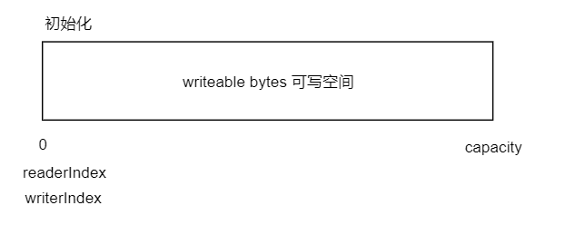

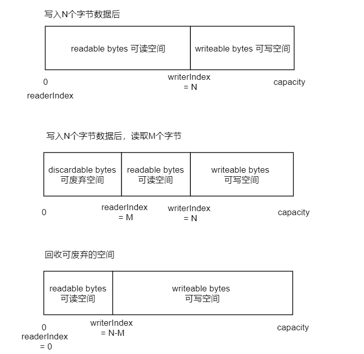


当执行clear()方法时，索引位置清空回初始位置，但数据保持不变。

mark和reset方法在ByteBuf中同样适用，如markReaderIndex和resetReaderIndex。


##### B  深浅拷贝

浅拷贝，拷贝的是对对象的引用，并没有创建新对象，新对象和原对象之间互相影响。
深拷贝，拷贝的是整个对象，和原对象之间完全独立。

duplicate和slice方法，达成全部浅拷贝和部分浅拷贝。
copy，部分深拷贝，部分代表的是可读空间。


#### 3）扩容机制

##### A ByteBuffer的存储

ByteBuffer在put数据时，会校验剩余空间是否不足，如果不足，会抛出异常。

```
ByteBuffer buffer = ByteBuffer.allocate(8);
buffer.put("yu".getBytes());

----------------------------------------------------

    public final ByteBuffer put(byte[] src) {
        return put(src, 0, src.length);
    }
    
    // 额外接收偏移量（存储数据的起始位置）  和数据长度
    public ByteBuffer put(byte[] src, int offset, int length) {
        // 校验参数的有效性
        checkBounds(offset, length, src.length);
        // 如果要存储数据的长度 > 剩余可用空间  抛出buffer越界的异常
        if (length > remaining())
            throw new BufferOverflowException();
        // 如果剩余空间足够  计算存储的结束位置 = 偏移量 + 数据长度    
        int end = offset + length;
        for (int i = offset; i < end; i++)
            this.put(src[i]);
        return this;
    }    
```

如果要手动对ByteBuffer扩容，可以在put之前，先校验剩余空间是否足够，如果不足够，创建一个新的ByteBuffer，新的容量确保足够，旧的buffer数据拷贝到新的buffer中，然后继续存储数据。


##### B ByteBuf的存储和扩容

当写数据时，先判断是否需要扩容，如果当前空间较小（<4M），以64作为基数倍增（10 -> 64 -> 128 -> 256）, 如果当前空间较大（>4M）, 每次扩容都增加4M，这种方式叫做"步进式"。

```

查看源码，以AbstractByteBuf子类为依据查看，最重要的子类之一，ByteBuf的公共属性和功能都在此中实现。

ByteBuf buf = Unpooled.buffer(10);
System.out.println("capacity: " + buf.capacity());
for (int i = 0; i < 11; i++) {
    buf.writeByte(i);
}
----------------------------------------------------   

[ByteBuf类]
public abstract ByteBuf writeByte(int value);

按住Ctrl+Alt快捷键

[AbstractByteBuf子类]
---------------------------------------------------- 
    @Override
    public ByteBuf writeByte(int value) {
        // 确保可写空间足够
        ensureWritable0(1);
        // 写入数据
        _setByte(writerIndex++, value);
        return this;
    }
    
    // 参数为 最小写入数据的大小
    final void ensureWritable0(int minWritableBytes) {
        final int writerIndex = writerIndex();
        // 目标容量 = 当前写操作索引 + 最小写入数据大小
        final int targetCapacity = writerIndex + minWritableBytes;
        // 容量足够  不需扩容
        if (targetCapacity <= capacity()) {
            ensureAccessible();
            return;
        }
        // 容量不足时 如果目标容量 超出最大容量  抛出异常
        if (checkBounds && targetCapacity > maxCapacity) {
            ensureAccessible();
            throw new IndexOutOfBoundsException(String.format(
                    "writerIndex(%d) + minWritableBytes(%d) exceeds maxCapacity(%d): %s",
                    writerIndex, minWritableBytes, maxCapacity, this));
        }
		
		// 扩容逻辑
        // 获取可写空间大小
        final int fastWritable = maxFastWritableBytes();
        // 如果 可写空间 >= 所需空间   新的容量=写操作索引+可写空间大小 
        // 如果 可写空间 < 所需空间   计算要扩容的新容量大小 calculateNewCapacity方法
        int newCapacity = fastWritable >= minWritableBytes ? writerIndex + fastWritable
                : alloc().calculateNewCapacity(targetCapacity, maxCapacity);

        // Adjust to the new capacity.
        
        // 计算完成后 生成新的ByteBuffer
        capacity(newCapacity);
    }
    
    // 获取可写空间大小
    public int maxFastWritableBytes() {
        return writableBytes();
    }
    

[AbstractByteBufAllocator子类]
---------------------------------------------------- 
    // 计算要扩容的新容量大小
    @Override
    public int calculateNewCapacity(int minNewCapacity, int maxCapacity) {
        // 校验参数有效性
        checkPositiveOrZero(minNewCapacity, "minNewCapacity");
        if (minNewCapacity > maxCapacity) {
            throw new IllegalArgumentException(String.format(
                    "minNewCapacity: %d (expected: not greater than maxCapacity(%d)",
                    minNewCapacity, maxCapacity));
        }
        // 扩容方式的分界点 以4M大小为界
        final int threshold = CALCULATE_THRESHOLD; // 4 MiB page

        if (minNewCapacity == threshold) {
            return threshold;
        }

        // If over threshold, do not double but just increase by threshold.、
        // 如果所需容量大于4M  按照步进的方式扩容 
        //   举例： 比如 minNewCapacity = 5M  
        if (minNewCapacity > threshold) {
            // newCapacity = 5 / 4 * 4 = 4M  确保是4的倍数
            int newCapacity = minNewCapacity / threshold * threshold;
            if (newCapacity > maxCapacity - threshold) {
                newCapacity = maxCapacity;
            } else {
                // newCapacity = 4 + 4 = 8M;
                newCapacity += threshold;
            }
            return newCapacity;
        }

        // Not over threshold. Double up to 4 MiB, starting from 64.
        // 如果所需容量大于4M  按照64的倍数扩容  找到最接近所需容量的64的倍数
        int newCapacity = 64;
        while (newCapacity < minNewCapacity) {
            newCapacity <<= 1;
        }
        
        // 保障在最大可接受容量范围内
        return Math.min(newCapacity, maxCapacity);
    }

```


#### 4）优势

A 池化的方式提高内存使用率

B 提出了复合型缓冲区的整合方案

C 增加了索引，使读写分离，使用更便捷

D 解决了ByteBuffer长度固定的问题，增加了扩容机制

E  用引用计数的方式进行对象回收


